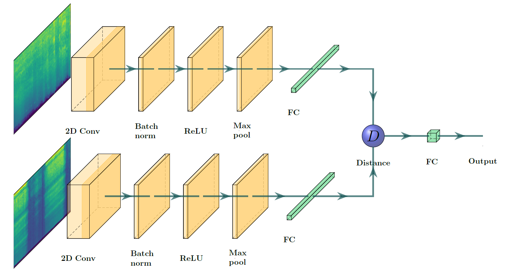

# Oneshot Learning with Siamese Networks for Environmental Audio
The purpose of this reposirory is to provide a working example of a oneshot learning implementation utilizing siamese networks for environmental audio classification. This code was done as part of a BSc thesis at Tampere University.

## Table of contents
1. [Dependencies](#dependencies)
2. [Dataset](#dataset)
3. [Model](#model)
4. [How to use](#how-to-use)

## Dependencies 
- Keras
- Hyperopt
- LibROSA
- scikit-learn
- Matplotlib

## Dataset 
For this example script, the ESC-50 dataset is used. The dataset is available here: [ESC-50](https://github.com/karoldvl/ESC-50)
Clone the repository to the root of this repository, or alternative change the data path variable in main.py/parameter_optimization.py

## Model 
The model consists of two convolutional input networks, followed by
a merging layer and a final output layer. The input networks share the same architecture
and weights in order to act as identical encoding layers for both inputs. This also
means that the weights are updated simultaneously for both networks during training.
The basic idea of the model is illustrated below.

## How to use 
Download [ESC-50](https://github.com/karoldvl/ESC-50) and move it to the root of this repository (or change the data path variable in main.py/parameter_optimization.py)

### Train and evaluate a siamese network
1. Run main.py. The script should start by setting up the environment, reading audio files and calculating a mel-log scaled spectrogram for each audio sample. The spectra are then saved for future, i.e. the next time the script is run the spectra are not required to be calculated.
2. Next, the script will start the training procedure. If a previously saved model is found, the training is continued from that. By default 40 classes are used for training, 5 for validation and 5 for evaluation. Change the split size at the start of the script to experiment with different splits. Batch size is a limiting factor here (change if needed), since a single training sample consists of two spectra. Negative-to-positive ratio refers to the ratio between different pairs and similar pairs, since the number of negative pairs can be made significantly higher than positive pairs. The actual training is done inside a for-loop, where a model is trained for a single epoch and validated with the one-shot task. Early stopping and best model checkpoint are also implemented here. 
3. Finally, the results for the evaluation are calculated, visualized and saved to *results* folder.

### Hyperparameter optimization
Currently the default parameters for a siamese network instance are set to previously optimized parameters. If additional optimization is desired (e.g. for new parameters), parameter_optimization.py can be executed.
1. Run parameter_optimization.py. The script should start fitting a model to parameters chosen from the parameter space defined at the top of the file.
2. After training, the model is evaluated using validation data. The one-shot classification score is used as the optimized objective. The next parameters will be chosen based on previous iterations. Additionally, the current state of the optimizer is saved. If a saved state is found at the start of a new iteration, it is loaded and continued from.
3. The best parameters so far are saved after each iteration. The optimization can be stopped at any point, and the current best parameters can be loaded from *checkpoint* folder.
